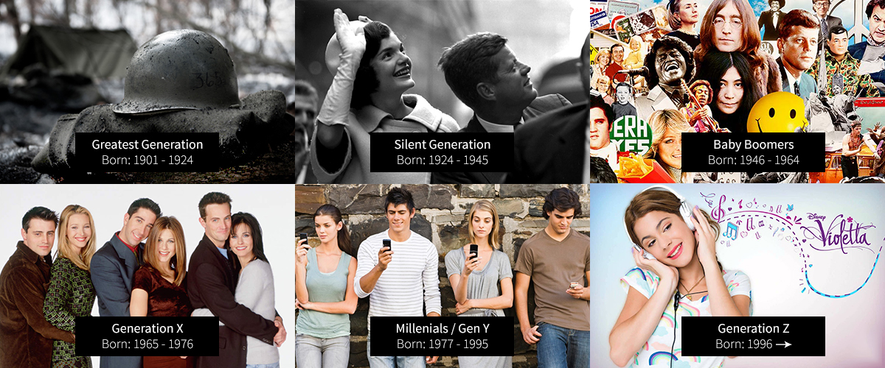

# 유권자 {#voters}

## 유권자 분류 {#voters-group}

```{r voters-tab, eval = FALSE}
library(tidyverse)
library(idbr)
library(reactable)

## 인구 데이터 가져오기 ----------------------------------

idb_api_key(Sys.getenv("IDBR_Key"))

korea_dat <- get_idb(
  country = "Korea",
  year = 2021,
  age = 1:100,
  sex = c("male", "female")
)

korea_dat %>% 
  write_csv("data/korea_dat.csv")
```

``` {r run-generation}
library(tidyverse)
library(idbr)
library(reactable)

korea_dat  <- read_csv("data/korea_dat.csv")

## 세대구분 전처리 작업 ----------------------------------

korea_tbl <- korea_dat %>% 
  pivot_wider(names_from = sex, values_from = pop) %>% 
  janitor::clean_names() %>% 
  mutate(population = male + female) %>% 
  # 출생년도 기준으로 세대 구분
  mutate(dob = 2021 - age) %>% 
  mutate(generation = case_when(dob <= 1953 ~ "한국전쟁",
                                dob > 1953 & dob <=1963 ~ "베이비붐어",
                                dob > 1963 & dob <=1980 ~ "X-세대",
                                dob > 1980 & dob <=1998 ~ "Y-세대",
                                TRUE ~ "MZ-세대")) %>% 
  mutate(generation = factor(generation, levels = c("한국전쟁", "베이비붐어", "X-세대", "Y-세대", "MZ-세대"))) %>% 
  select(age, male, female, population, generation)
  
## 표 작업 ----------------------------------

korea_gen_tbl <- korea_tbl %>% 
  group_by(generation) %>% 
  summarise(population = sum(population)) %>% 
  ungroup() %>% 
  mutate(proportion = population / sum(population) ) %>% 
  mutate(media_tech = c("Newspaper", "Television", "PC", "Smart Phone+Internet", "Metaverse"),
         strategy   = c("TV/Newspaper", "TV/Newspaper", "SMS/Blog/WEB", "SNS/APP", "Metaverse"),
         age_group  = c("     ~ 1953", "1954 ~ 1963", "1964 ~ 1980", "1981 ~ 1998", "1999 ~")) %>% 
  relocate(age_group, .before = population)

korea_gen_tbl %>% 
  reactable::reactable( columns = list(
    generation = colDef(name = "세대", minWidth = 60),
    age_group  = colDef(name = "출생년도", minWidth = 60),
    population = colDef(name = "인구수", format = colFormat(separators = TRUE), minWidth = 60),
    proportion = colDef(name = "인구수", format = colFormat(percent = TRUE, digits = 1), minWidth = 40),
    media_tech = colDef(name = "미디어", minWidth = 100),
    strategy   = colDef(name = "전략", minWidth = 100))
  )

```

현재(2021년) 기준으로 대한민국 인구구조를 [`idbr`](https://cran.r-project.org/web/packages/idbr/) 팩키지 [미국 통계국 데이터베이스(IDB)](https://www.census.gov/data/developers/data-sets/international-database.html)에서 추출한 데이터.

- ~ 1953년: 한국전쟁 세대
- 1954년 ~ 1963년: 베이비붐어 세대
- 1964년 ~ 1980년: X세대
- 1981년 ~ 1998년: Y세대
- 1999년 ~       : MZ세대

참조: [대한민국 인구 피라미드](http://statkclee.github.io/politics/pe-population-pyramid.html)

## 영국 세대별 세분화 {#uk-generation} 

영국을 크게 6개 세대로 세분화하고 각 세대별 특징을 다음과 같이 정의. [^uk-generation-guide]




[^uk-generation-guide]: [The Generation Guide - Millennials, Gen X, Y, Z and Baby Boomers](http://fourhooks.com/marketing/the-generation-guide-millennials-gen-x-y-z-and-baby-boomers-art5910718593/)

