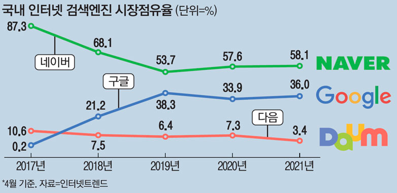

# 구글 추세 {#google-trends}

## 검색엔진 점유율 {#search-engine}

매일경제 ["구글 추격 따돌리자"…네이버 검색 지금보다 똑똑해진다](https://www.mk.co.kr/news/it/view/2021/05/463524/) 기사에 따르면 인터넷트렌드 자료를 인용하여 네이버와 구글의 검색엔진 시장 점유율을 다음과 같이 대략 6:4 정도로 추정하고 있다.



## 시대정신 키워드 트렌드 {#keywords-again}

```{r gtrends-ingest, eval = FALSE}
library(tidyverse)
library(gtrendsR)

Sys.setlocale("LC_ALL", "C")

zeitgeist <- gtrends(
  keyword = c("민주", "경제", "탄핵", "기본소득", "정의"),
  geo     = "KR",
  time    = "all")

Sys.setlocale("LC_ALL", "Korean")

zeitgeist %>% 
  write_rds("data/zeitgeist_20210601.rds")
```

```{r gtrends-EDA}
zeitgeist <- read_rds("data/zeitgeist_20210601.rds")

zeitgeist_time_tbl <- zeitgeist$interest_over_time %>% 
  as_tibble() %>% 
  mutate(hits = as.integer(hits))

zeitgeist_trends_gg <- zeitgeist_time_tbl %>% 
  ggplot(aes( x = date, y = hits, color = keyword,
              text = paste('날짜 :', date, "\n",
                           '키워드 :', keyword, "\n",
                           '관심도:', hits))) +
    geom_point(size = 1) +
    geom_line(aes(group = keyword)) +
    labs( x = "",
          y = "관심도",
          color = "키워드",
          title = "시간의 흐름에 따른 관심도 변화",
          subtitle = "민주, 경제, 탄핵, 기본소득, 정의") +
    theme_minimal(base_family = "NanumGothic")

# zeitgeist_trends_gg
```

```{r gtrends-EDA-interactive}
library(plotly)
ggplotly(zeitgeist_trends_gg, tooltip = "text")
```


## 시도별 시대정신 {#keywords-by-region}

[Google Trends](https://trends.google.com/trends/explore?date=all&geo=KR&q=민주,경제,탄핵,기본소득,공정) 비교 GUI 화면에서 "하위 지역별 비교 분석" 다운로드 버튼을 눌러 데이터를 `zeitgeist_geoMap_20210530.csv` 파일로 저장한 후에 시각화해서 비교 분석한다.

```{r gtrends-EDA-region}

geomap_dat <- read_csv("data/zeitgeist_geoMap_20210601.csv", skip = 2)

geomap_dat %>% 
  # 데이터 전처리 ----------------
  set_names(c("지역", "민주", "경제", "탄핵", "기본소득", "정의")) %>% 
  pivot_longer(-지역, names_to = "키워드", values_to = "관심도") %>% 
  mutate(관심도 = parse_number(관심도)) %>% 
  mutate(키워드 = factor(키워드, levels = c("민주", "경제", "탄핵", "기본소득", "정의"))) %>% 
  ggplot(aes(x = 키워드, y = 관심도,  fill = 키워드)) +
    geom_col() +
    facet_wrap(~지역) +
    theme_bw(base_family = "NanumGothic") +
    theme(legend.position = "top") +
    labs(x = "", y="")
```


## 연관키워드 시대정신  {#keywords-by-keyword2}

[kateo 미디어 데이터](https://statkclee.github.io/network/tidygraph-media.html#22_%EA%B2%B0%EC%A0%90%EA%B3%BC_%EC%97%B0%EA%B2%B0%EC%84%A0_%EB%8D%B0%EC%9D%B4%ED%84%B0_%EC%A0%95%EC%A0%9C) 네트워크 데이터 분석을 참고하여 데이터를 추후 정제한다. 

```{r gtrends-EDA-linked-keywords, eval = TRUE}
library(ggraph)
library(tidygraph)

## 노드
keyword_node_tbl <- zeitgeist_time_tbl %>% 
  group_by(keyword) %>% 
  summarise(hits = mean(hits, na.rm = TRUE)) %>% 
  mutate(from = "GT") %>% 
  select(from, to = keyword, weight = hits)

## 엣지 ---------------------------------------------

keyword_edge_tbl <- zeitgeist$related_queries %>% 
  as_tibble() %>% 
  # 맥에서 컴파일 하면 필요없음 -----------------------------------
  # mutate(value = iconv(value, from = "utf-8", to = "cp949")) %>% 
  mutate(subject = as.numeric(subject)) %>% 
  filter(!is.na(subject)) %>% 
  select(from = keyword, to = value, weight = subject) %>% 
  bind_rows(keyword_node_tbl)


keyword_nodes <- keyword_edge_tbl %>% 
  select(from, to) %>% 
  pivot_longer(from:to) %>% 
  count(value) %>% 
  mutate(id = row_number()-1) %>% 
  select(id, keyword = value)
  # Add hits
  # left_join(keyword_node_tbl) %>% 
  # arrange(hits)

## -----------------------------------------------
## From text to number 

## 1.3. 네트워크 데이터 정제: 연결선 -----
### 연결선을 결점과 연결
keyword_edge <- keyword_edge_tbl %>%
  left_join(keyword_nodes, by=c("from" = "keyword")) %>%
  select(-from) %>% 
  rename(from = id)

keyword_edge <- keyword_edge %>%
  left_join(keyword_nodes, by = c("to" = "keyword")) %>%
  select(-to) %>% 
  rename(to = id)

keyword_edge <- keyword_edge %>% 
  select(from, to, weight)

## 1.4. 네트워크 데이터 변환(tidygraph) -----

keyword_nodes <- keyword_nodes %>%
  left_join(keyword_node_tbl, by = c("keyword" = "to")) %>% 
  select(id, keyword, hit = weight)

```


```{r networkd3}
library(networkD3)

keyword_nw <- forceNetwork(Links = keyword_edge, Nodes = keyword_nodes,
            Source = "from", Target = "to",
            NodeID = "keyword",
            Group = "keyword",
            bounded = TRUE,
            opacityNoHover = TRUE,
            zoom = TRUE,
            Nodesize = "hit",
            fontSize = 15,
            linkDistance = 95,
            opacity = 1)

keyword_nw
```

