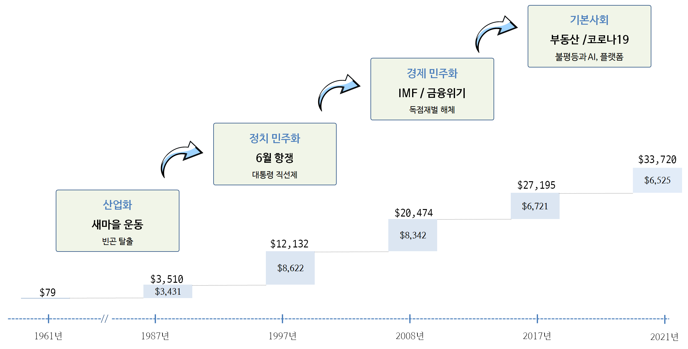
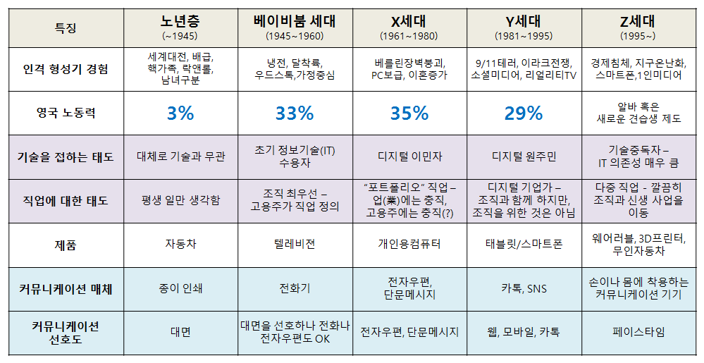

--- 
title: "시대정신"
subtitle: "기계와 인간 그리고 자연"
author: "이광춘"
date: "`r Sys.Date()`"
site: bookdown::bookdown_site
documentclass: book
bibliography: [book.bib, packages.bib]
biblio-style: apalike
link-citations: yes
description: "2021년 대통령 선거에 바라는 시대정신을 정리합니다."
---

```{r setup, include=FALSE}
knitr::opts_chunk$set(echo = FALSE, message=FALSE, warning=FALSE,
                      comment="", digits = 3, tidy = FALSE, prompt = FALSE, fig.align = 'center')
```


# 대한민국 성장과정 {-}

1961년 박정희 군사혁명으로 시작된 군사독재는 1987년 6월항쟁을 거치며 외형상 **정치민주화**를 이뤘다.
박정희 정권과 더불어 성장한 경제 재벌체계는 1997년 IMF 경제위기를 거치며 독점재벌 해체를 통해 외형상 **경제민주화**를 이뤘다.
김대중, 노무현 정권을 통해 정보기술과 더불어 FTA를 통한 확대전략을 통해 2008년 세계 경제위기를 거치며 외형상 **정보민주화**를 이뤘다.

하지만, 실용정부를 표방한 이명박 정부는 4대강 사업, 창조경제를 내세운 박근혜 대통령은 최신실 게이트에 얽혀 국정동력을 완전히 상실했다. 성장동력이 상실한 근본적인 원인은 정치, 경제, 정보민주화를 외형상 이뤄냈지만, 내재화하고 이를 다져가는데 실패했다는 점은 인정해야만 되는 시점이다.

정치민주화, 경제민주화, 정보민주화 토대 위에서 꽃필 수 있는 **제4차 산업혁명**의 기반은 디지털 정부 순위, 정부 인공지능 준비지수, 세계 경쟁력 보고서, IMD 세계 경쟁력 연감 등을 통해서 확인된다. [@kclee2020]

시간을 되돌려 10년 전으로 돌아가면 자산가치 붕괴, 중국성장 둔화, 소득 불균형, 미국 재정적자와 같은 경제적 위험이 큰 과제였다면 현재는 기상 이변, 자연 재해, 온실가스, 생물 다양성 감소와 같은 **환경적 위험**이 누구나 손꼽는 최우선 과제임은 재론의 여지가 없다.

신 기후체제에 대응하기 위해 글로벌 선진국들은 **탄소중립(Net Zero)**을 강력히 추진하고 있으며 국가별 친환경 정책이 지속 추진되고 있으며 **코로나 19**로 인한 **불평등**을 완화하고 성장동력을 만들어내야 하는 것이 **새로운 시대정신**이다.




<!--chapter:end:index.Rmd-->

# 시대정신 


## 역대 대선의 시대정신과 승패요인 [^khan-2021-I] [^khan-2021-II] {#donga-ilbo}

[^khan-2021-I]: [김호기 (2021), "2022년 대선’의 시대정신 (1)", 경향신문, 시대정신](http://news.khan.co.kr/kh_news/khan_art_view.html?art_id=202103090300035)

[^khan-2021-II]: [김호기 (2021), "2022년 대선’의 시대정신 (2)", 경향신문, 시대정신](http://news.khan.co.kr/kh_news/khan_art_view.html?artid=202103300300035)


|  대선  |      시대정신        |   대선승패 결정적 요인(이슈) | 추진 공약   |
|--------|----------------------|-----------------------------------|-----------|
| 1987년 | 민주화운동, 군정종식 | 야권 후보 분열, 지역대결          |  .  |
| 1992년 |      문민정부        |       지역 대결                   | 문민정부(김영삼)  |
| 1997년 | 수평적 정권교체      | DJP 연합, 병풍                    | IMF 극복(김대중) |
| 2002년 | 탈권위, 지역주의 청산 | 대선후보 단일화, 행정수도 이전 제2의 병풍 | 정치 개혁(노무현) |
| 2007년 | 10년 좌파정권 심판, 경제살리기(성장경제) | 전 정권에 대한 민심이반, 경제이슈 부상 | 경제성장(이명박) |
| 2012년 | 복지국가,경제민주화,통합 | 국정원댓글, 이정희 | 국민행복(박근혜) |
| 2017년 | 적폐청산, 새로운 대한민국  | 국정농단, 탄핵 |  정의 (문재인) |
| *2022년* | 불평등, 불안  | 부동산(양극화), AI와 플랫폼, 출산율 | 기본사회(이재명) |


산업화 &rarr; 민주화 &rarr; ???

세계화, 선진화, 복지국가, 

## 역대 대선 시대정신 {#zeitgeist-president}    

- [동아일보를 통해 본 선거(하) 역대 대선에서 드러난 시대정신은?](http://dongne.donga.com/2012/06/02/동아일보-속의-선거-9-대선후보와-시대정신/)
- [김재범 (2017), "대통령선거와 시대정신", 제주일보 오피니언 춘하추동](https://jejunews.com/news/articleView.html?idxno=2012792)

|     대선   |         보수         |         중도         |         진보         |
|------------|----------------------|----------------------|----------------------|
| 15대(1997) |    3김 청산          |                      | 국난극복, 햇볕정책, 제2의 건국 |
|  **IMF**   |      (이회창)        |                      |       (김대중)       |
| 16대(2002) |    병풍              |                      |       행정수도, 개헌, 노사모       |
|  **경제**  |      (이회창)        |                      |       (노무현)       |
| 17대(2007) | 경제, 정권교체       |                      |       부패척결       |
|  **경제**  |      (이명박)        |                      |       (정동영)       |
| 18대(2012) | 여성대통령/경제민주화|       새정치         |     사람이 먼저다    |
|  **경제**  |      (박근혜)        |      (안철수)        |       (문재인)       |
| 19대(2017) |      대란대치 [^hjp]       |  정의/공정과 미래    |     나라를 나라답게/정의  |
|  **정의**  |      (홍준표)        |    (유승민/안철수)   |       (문재인/심상정)     |
| 20대(2022) |        ???           |        ???           |     기본사회/???/???  |
|  **정의**  |      (윤석렬)        |       (???)          |       (이재명/이낙연/정세균)     |

[^hjp]: **대란대치(大亂大治)**는 경제대란, 외교안보대란이라는 큰 혼란을 큰 정치로 다스린다는 의미다.

## 2017년 대선 시대정신 {#zeitgeist-2017}

### 리얼미터 {#realmeter-zeitgeist}

[매경, 유승민보다 보수적인 안철수…대선 시대정신은 '정의'](http://mbn.mk.co.kr/pages/news/newsView.php?news_seq_no=3117720)에 따르면 **정의(34.9%)**와 **형평(17.7%)**을 강조한 문재인 후보가 통합(11.6%)과 안보(8.2%)를 강조한 반기문 후보보다 더 높은 지지율을 받고 있는 이유를 시대정신 키워드 선점을 통해 설명하고 있다.

- 정의: 34.9%
- 형평: 17.7%
- 통합: 11.6%
- 민주: 11.3%
- 안보: 8.2%


<!--chapter:end:01-zeitgeist.Rmd-->

# 유권자 {#voters}

## 유권자 분류 {#voters-group}

```{r voters-tab, eval = FALSE}
library(tidyverse)
library(idbr)
library(reactable)

## 인구 데이터 가져오기 ----------------------------------

idb_api_key(Sys.getenv("IDBR_Key"))

korea_dat <- get_idb(
  country = "Korea",
  year = 2021,
  age = 1:100,
  sex = c("male", "female")
)

korea_dat %>% 
  write_csv("data/korea_dat.csv")
```

``` {r run-generation}
library(tidyverse)
library(idbr)
library(reactable)

korea_dat  <- read_csv("data/korea_dat.csv")

## 세대구분 전처리 작업 ----------------------------------

korea_tbl <- korea_dat %>% 
  pivot_wider(names_from = sex, values_from = pop) %>% 
  janitor::clean_names() %>% 
  mutate(population = male + female) %>% 
  # 출생년도 기준으로 세대 구분
  mutate(dob = 2021 - age) %>% 
  mutate(generation = case_when(dob <= 1953 ~ "한국전쟁",
                                dob > 1953 & dob <=1963 ~ "베이비붐어",
                                dob > 1963 & dob <=1980 ~ "X-세대",
                                dob > 1980 & dob <=1998 ~ "Y-세대",
                                TRUE ~ "MZ-세대")) %>% 
  mutate(generation = factor(generation, levels = c("한국전쟁", "베이비붐어", "X-세대", "Y-세대", "MZ-세대"))) %>% 
  select(age, male, female, population, generation)
  
## 표 작업 ----------------------------------

korea_gen_tbl <- korea_tbl %>% 
  group_by(generation) %>% 
  summarise(population = sum(population)) %>% 
  ungroup() %>% 
  mutate(proportion = population / sum(population) ) %>% 
  mutate(media_tech = c("Newspaper", "Television", "PC", "Smart Phone+Internet", "Metaverse"),
         strategy   = c("TV/Newspaper", "TV/Newspaper", "SMS/Blog/WEB", "SNS/APP", "Metaverse"),
         age_group  = c("     ~ 1953", "1954 ~ 1963", "1964 ~ 1980", "1981 ~ 1998", "1999 ~")) %>% 
  relocate(age_group, .before = population)

korea_gen_tbl %>% 
  reactable::reactable( columns = list(
    generation = colDef(name = "세대", minWidth = 60),
    age_group  = colDef(name = "출생년도", minWidth = 60),
    population = colDef(name = "인구수", format = colFormat(separators = TRUE), minWidth = 60),
    proportion = colDef(name = "인구수", format = colFormat(percent = TRUE, digits = 1), minWidth = 40),
    media_tech = colDef(name = "미디어", minWidth = 100),
    strategy   = colDef(name = "전략", minWidth = 100))
  )

```

현재(2021년) 기준으로 대한민국 인구구조를 [`idbr`](https://cran.r-project.org/web/packages/idbr/) 팩키지 [미국 통계국 데이터베이스(IDB)](https://www.census.gov/data/developers/data-sets/international-database.html)에서 추출한 데이터.

- ~ 1953년: 한국전쟁 세대
- 1954년 ~ 1963년: 베이비붐어 세대
- 1964년 ~ 1980년: X세대
- 1981년 ~ 1998년: Y세대
- 1999년 ~       : MZ세대

참조: [대한민국 인구 피라미드](http://statkclee.github.io/politics/pe-population-pyramid.html)

## 영국 세대별 세분화 {#uk-generation} 

영국을 크게 6개 세대로 세분화하고 각 세대별 특징을 다음과 같이 정의. [^uk-generation-guide]




[^uk-generation-guide]: [The Generation Guide - Millennials, Gen X, Y, Z and Baby Boomers](http://fourhooks.com/marketing/the-generation-guide-millennials-gen-x-y-z-and-baby-boomers-art5910718593/)


<!--chapter:end:02-voters.Rmd-->

---
output: html_document
editor_options: 
  chunk_output_type: console
---
# 구글 추세 {#google-trends}

## 검색엔진 점유율 {#search-engine}

매일경제 ["구글 추격 따돌리자"…네이버 검색 지금보다 똑똑해진다](https://www.mk.co.kr/news/it/view/2021/05/463524/) 기사에 따르면 인터넷트렌드 자료를 인용하여 네이버와 구글의 검색엔진 시장 점유율을 다음과 같이 대략 6:4 정도로 추정하고 있다.


## 시대정신 키워드 트렌드 {#keywords-again}

```{r gtrends-ingest, eval = FALSE}
library(tidyverse)
library(gtrendsR)

# Sys.setlocale("LC_ALL", "C")

zeitgeist <- gtrends(
  keyword = c("민주", "경제", "탄핵", "기본소득", "공정"),
  geo     = "KR",
  time    = "all")

# Sys.setlocale("LC_ALL", "Korean")

zeitgeist %>% 
  write_rds("data/zeitgeist_20210531.rds")
```

```{r gtrends-EDA}
zeitgeist <- read_rds("data/zeitgeist_20210531.rds")

zeitgeist_time_tbl <- zeitgeist$interest_over_time %>% 
  as_tibble() %>% 
  mutate(hits = as.integer(hits))

zeitgeist_trends_gg <- zeitgeist_time_tbl %>% 
  ggplot(aes( x = date, y = hits, color = keyword,
              text = paste('날짜 :', date, "\n",
                           '키워드 :', keyword, "\n",
                           '관심도:', hits))) +
    geom_point(size = 1) +
    geom_line(aes(group = keyword)) +
    labs( x = "",
          y = "관심도",
          color = "키워드",
          title = "시간의 흐름에 따른 관심도 변화",
          subtitle = "민주, 경제, 탄핵, 기본소득, 공정") +
    theme_minimal(base_family = "NanumGothic")

# zeitgeist_trends_gg
```

```{r gtrends-EDA-interactive}
library(plotly)
ggplotly(zeitgeist_trends_gg, tooltip = "text")
```


## 시도별 시대정신 {#keywords-by-region}

[Google Trends](https://trends.google.com/trends/explore?date=all&geo=KR&q=민주,경제,탄핵,기본소득,공정) 비교 GUI 화면에서 "하위 지역별 비교 분석" 다운로드 버튼을 눌러 데이터를 `zeitgeist_geoMap_20210530.csv` 파일로 저장한 후에 시각화해서 비교 분석한다.

```{r gtrends-EDA-region}

geomap_dat <- read_csv("data/zeitgeist_geoMap_20210530.csv", skip = 2)

geomap_dat %>% 
  # 데이터 전처리 ----------------
  set_names(c("지역", "민주", "경제", "탄핵", "기본소득", "공정")) %>% 
  pivot_longer(-지역, names_to = "키워드", values_to = "관심도") %>% 
  mutate(관심도 = parse_number(관심도)) %>% 
  mutate(키워드 = factor(키워드, levels = c("민주", "경제", "탄핵", "기본소득", "공정"))) %>% 
  ggplot(aes(x = 키워드, y = 관심도,  fill = 키워드)) +
    geom_col() +
    facet_wrap(~지역) +
    theme_bw(base_family = "NanumGothic") +
    theme(legend.position = "top") +
    labs(x = "", y="")
```


## 연관키워드 시대정신  {#keywords-by-keyword2}

[kateo 미디어 데이터](https://statkclee.github.io/network/tidygraph-media.html#22_%EA%B2%B0%EC%A0%90%EA%B3%BC_%EC%97%B0%EA%B2%B0%EC%84%A0_%EB%8D%B0%EC%9D%B4%ED%84%B0_%EC%A0%95%EC%A0%9C) 네트워크 데이터 분석을 참고하여 데이터를 추후 정제한다. 

```{r gtrends-EDA-linked-keywords, eval = TRUE}
library(ggraph)
library(tidygraph)

## 노드
keyword_node_tbl <- zeitgeist_time_tbl %>% 
  group_by(keyword) %>% 
  summarise(hits = mean(hits, na.rm = TRUE)) %>% 
  mutate(from = "GT") %>% 
  select(from, to = keyword, weight = hits)

## 엣지 ---------------------------------------------

keyword_edge_tbl <- zeitgeist$related_queries %>% 
  as_tibble() %>% 
  mutate(subject = as.numeric(subject)) %>% 
  filter(!is.na(subject)) %>% 
  select(from = keyword, to = value, weight = subject) %>% 
  bind_rows(keyword_node_tbl)


keyword_nodes <- keyword_edge_tbl %>% 
  select(from, to) %>% 
  pivot_longer(from:to) %>% 
  count(value) %>% 
  mutate(id = row_number()) %>% 
  select(id, keyword = value)
  # Add hits
  # left_join(keyword_node_tbl) %>% 
  # arrange(hits)

## -----------------------------------------------
## From text to number 

## 1.3. 네트워크 데이터 정제: 연결선 -----
### 연결선을 결점과 연결
keyword_edge <- keyword_edge_tbl %>%
  left_join(keyword_nodes, by=c("from" = "keyword")) %>%
  select(-from) %>% 
  rename(from = id)

keyword_edge <- keyword_edge %>%
  left_join(keyword_nodes, by = c("to" = "keyword")) %>%
  select(-to) %>% 
  rename(to = id)

keyword_edge <- keyword_edge %>% 
  select(from, to, weight)

## 1.4. 네트워크 데이터 변환(tidygraph) -----

keyword_nodes <- keyword_nodes %>%
  left_join(keyword_node_tbl, by = c("keyword" = "to")) %>% 
  select(id, keyword, hit = weight)


keyword_tidy_nw <- tbl_graph(
  nodes = keyword_nodes, edges = keyword_edge, directed = TRUE
)

```


```{r ggraph-visualization}
keyword_tidy_nw %>% 
  ggraph(layout = "kk") +
    geom_edge_link(aes(width = weight / 100)) +
    geom_node_point(aes(size = hit)) + 
    theme_graph()
```


<!--chapter:end:03-google-trends.Rmd-->

`r if (knitr::is_html_output()) '
# 참고문헌 {-}
'`

<!--chapter:end:06-references.Rmd-->

